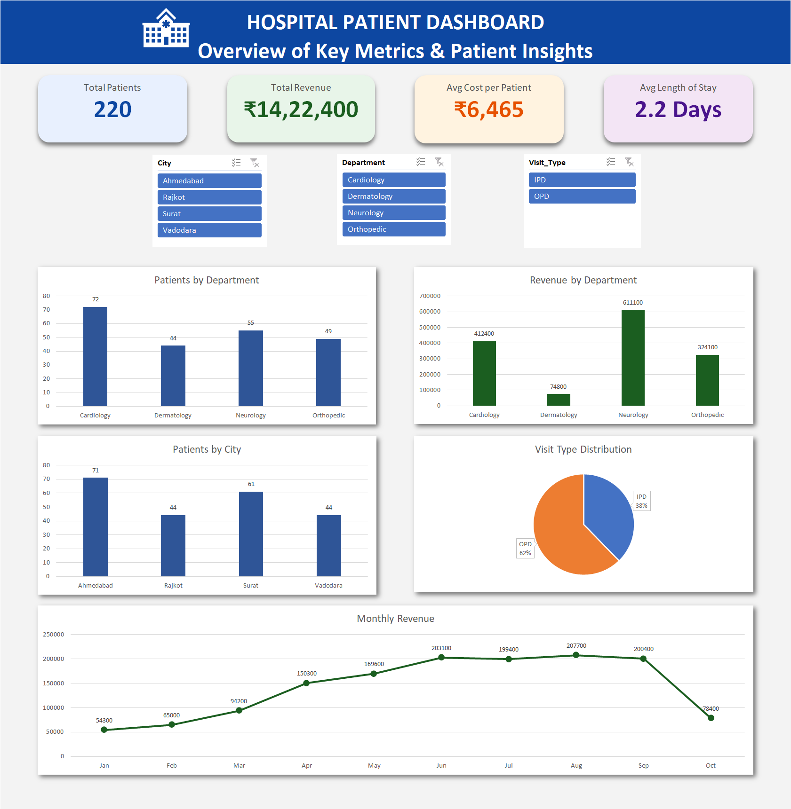

# 🏥 Hospital Patient Dashboard

## 📊 Overview

This project is an **interactive Excel dashboard** that provides insights into hospital patient data, including patient distribution, revenue trends, and departmental performance.

It helps in understanding key metrics and supports data-driven decision making.

---

## 🚀 Features

* 📌 KPI Cards:

  * Total Patients
  * Total Revenue
  * Average Cost per Patient
  * Average Length of Stay

* 📊 Visual Analysis:

  * Patients by Department
  * Revenue by Department
  * Patients by City
  * Visit Type Distribution (IPD vs OPD)
  * Monthly Revenue Trend

* 🎯 Interactive Filters:

  * City slicer
  * Department slicer
  * Visit Type slicer

* 🧠 Key Insights:

  * Neurology generates the highest revenue
  * Ahmedabad has the highest patient count
  * OPD visits dominate overall
  * Revenue peaks during mid-year months

---

## 🛠 Tools Used

* Microsoft Excel
* Pivot Tables
* Pivot Charts
* Slicers
* Data Visualization

---

## 📸 Dashboard Preview

---

## 📂 Project Files

* `hospital-patient-dashboard.xlsx` → Main dashboard file
* `dashboard-preview.png` → Dashboard screenshot

---

## 📈 Key Learnings

* Data cleaning and structuring
* Creating interactive dashboards using slicers
* Visualizing data with appropriate chart types
* Generating business insights from raw data

---

## 💼 Use Case

This project demonstrates strong skills in:

* Data Analysis
* Dashboard Design
* Business Insights
* Excel Reporting

---

## 🔥 Author

Krunal
Aspiring Data Analyst
